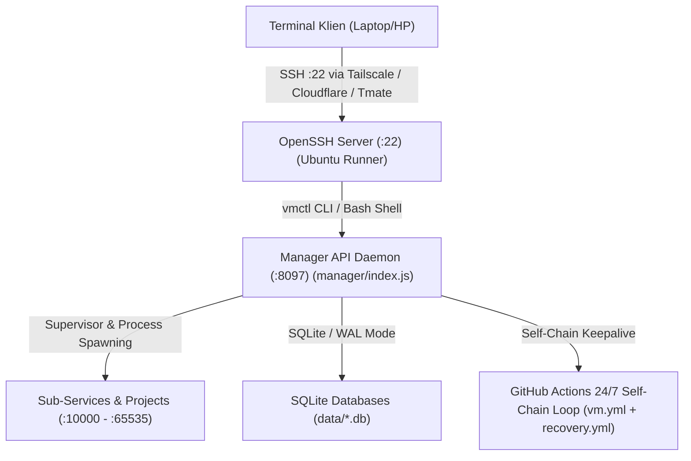

# AGENTS.md — Petunjuk & Aturan Komprehensif Coding Agent VM-Panel (ORIONT)

Dokumen ini adalah pedoman operasional dan teknis yang **wajib dipatuhi** oleh semua coding agent yang bekerja di repositori ini.

---

## 1. Aturan Pokok (Non-Negotiable Core Rules)

1. **Sistem 100% Fresh**:
   Repo ini adalah sistem terisolasi dan mandiri. **DILARANG** membaca, menghubungkan, menyalin, atau memakai data, credential, repo, bot, panel, atau DB apa pun dari luar folder ini.
2. **Dilarang Hardcode Secret**:
   **DILARANG** hardcode token, password, API key, atau secret apa pun di kode, config, atau file environment. Secret hanya boleh diakses melalui secret refs (`secrets/secrets.yaml`) yang menunjuk ke vault terenkripsi (`secrets/vault.enc`).
3. **Dilarang Menulis Secret ke Artefak Non-Secret**:
   **DILARANG** menulis secret ke log, audit trail, README, response frontend, atau file publik lainnya. Log hanya boleh berisi ID referensi secret atau `***REDACTED***`.
4. **Operasi Destruktif Wajib Two-Phase Confirm**:
   Setiap operasi destruktif (delete project, stop/kill service, restore-overwrite backup, rollback deployment, reset db) **wajib** melalui mekanisme two-phase: fase 1 meminta token konfirmasi, fase 2 baru mengeksekusi setelah token cocok.
5. **Gaya Kode & Dependensi Minimal**:
   - Modul standar **ESM** (`import`/`export`), runtime **Node.js >= 20**.
   - **HANYA SATU dependensi produksi**: `better-sqlite3`. **DILARANG** menambah dependensi npm produksi lain tanpa persetujuan eksplisit.
6. **Unit Test Wajib**:
   Setiap modul dan fitur baru **wajib** memiliki unit test menggunakan test runner bawaan `node:test`. Modul tanpa test = belum selesai.
7. **Definisi Selesai**:
   Klaim pekerjaan "selesai" hanya valid jika **`npm test` 100% hijau** (semua unit tests lulus).
8. **Verifikasi Nyata (Anti-Halusinasi)**:
   **DILARANG** mengklaim service "live", "running", atau "fixed" tanpa bukti nyata: proses hidup, port merespons HTTP, health check lolos, dan screenshot/DOM browser diverifikasi.

---

## 2. Arsitektur & Topologi Sistem

ORIONT VPANEL kini beroperasi sebagai **Headless Linux VPS Engine 24/7**:



### Port & Proses Default:
- **OpenSSH Server**: Port `22` (dikonfigurasi via `scripts/setup_vps_ssh.sh`, autentikasi murni SSH public key, password dinonaktifkan).
- **Reverse Tunnel**: Tailscale (`vpanel-vps`) / Cloudflare Tunnel / fallback Tmate via `scripts/start_tunnel.sh`.
- **Manager API**: `http://127.0.0.1:8097` (`node manager/index.js`).
  - Mengelola lifecycle project, service spawning, monitoring health, process tree, audit trail, dan vault terenkripsi.
  - Akses diamankan dengan Bearer token di `runtime/sockets/cli-token` atau env `VM_PANEL_TOKEN`.
- **vmctl CLI**: Perkakas baris perintah (`bin/vmctl.js` disymlink ke `/usr/local/bin/vmctl`) untuk kontrol langsung dari sesi SSH.
- **Port Alokasi Proyek**: Port dinamis (misal `:20127`, `:10001`) yang dialokasikan otomatis dan diverifikasi ketersediaannya sebelum start.

---

## 3. Headless VPS & Akses SSH 24/7

> [!NOTE]
> Seluruh antarmuka grafis Web UI (`panel/`) dan Desktop Electron (`desktop/`) telah dihapus 100% bersih tanpa sisa untuk performa maksimal dan fokus murni sebagai server VPS.

### Fitur Headless VPS:
1. **Akses SSH Penuh**:
   - Injeksi SSH Key via secret `SSH_PUBLIC_KEY`.
   - Hak sudo tanpa password (`NOPASSWD:ALL`).
   - Perkakas VPS bawaan: `tmux`, `htop`, `curl`, `neofetch`, `git`, `python3`, `node`.
2. **Kontinuitas 24/7 Tanpa Mati**:
   - Berjalan di GitHub Actions dengan alur self-chaining sebelum batas 6 jam.
   - Sinkronisasi state database terenkripsi AES-256-GCM ke branch `state`.
   - Watchdog pemulihan otomatis (`recovery.yml`) tiap 15 menit.
3. **Persistensi State Lengkap**:
   - Seluruh database SQLite di-checkpoint secara anggun sebelum pergantian runner.
   - Sesi terminal dapat dipulihkan menggunakan `tmux`.

---

## 4. Alur Deployment & Generative Orchestrator

Sistem mendukung alur inspeksi dan deployment project cerdas:
1. **Dropzone / Browse Folder**:
   User dapat drag & drop folder project dari Windows Explorer atau memilih direktori lokal.
2. **Auto-Detect Runtime**:
   - Jika ada `package.json` → Runtime **Node.js** (`npm start` atau `node index.js`).
   - Jika ada `requirements.txt` / `main.py` → Runtime **Python** (`python -m uvicorn` atau `python main.py`).
   - Jika ada `index.html` → Runtime **Static Web** (internal lightweight server).
3. **Modal Generative Deployment**:
   - Conversational UI Hermes Co-Pilot untuk perintah cepat (`ganti port`, `cek token`, `deploy`).
   - Runtime configuration card (nama project, port, start command).
   - Environment variables / secret binding (key-value editor).
   - Auto 24/7 Cloud Sync toggle (menulis ke `projects.auto.json` untuk disinkronkan ke GitHub Actions Runner).

---

## 5. Basis Data SQLite (`data/*.db`)

Data disimpan dalam 9 database SQLite terpisah dengan skema WAL (Write-Ahead Logging):
1. `projects.db`: Definisi proyek, runtime type, port, path workspace.
2. `services.db`: Status runtime service, PID proses, ports mapping.
3. `deployments.db`: Riwayat deployment, log output, exit status.
4. `health.db`: Riwayat health check, latensi, uptime tracking.
5. `audit.db`: Catatan audit trail yang memiliki trigger `no_delete` dan `no_update` (immutable append-only).
6. `backups.db`: Catatan snapshot cadangan database dan workspace.
7. `users.db`: User login, hash scrypt password, secret TOTP terenkripsi, session tokens.
8. `meta.db`: Metadata migrasi dan token internal.
9. `vault.db`: Konfigurasi metadata rahasia (kunci disimpan terenkripsi di `secrets/vault.enc`).

> **Catatan Autentikasi**: Untuk koneksi localhost (`127.0.0.1` / `::1`), sistem memiliki fitur physical bypass 2FA untuk kemudahan pengguna di laptop sendiri. Cookie sesi bernama `vpanel_session`.

---

## 6. Testing & Verifikasi

### Menjalankan Unit Test:
```bash
npm test
```
- Menjalankan 44 test suite di `tests/unit/*.test.js` menggunakan test runner native `node:test`.
- Seluruh 524 test wajib berstatus **PASS** (1 smoke test di-skip pada platform Windows karena POSIX only).

### Menjalankan Server untuk Development:
- Start seluruh service: `node start-all.mjs`
- Start panel saja: `node panel/server/index.js`
- Start manager saja: `node manager/index.js`
- Stop process yang menggunakan port:
  ```powershell
  npm run stop
  ```

---

## 7. Lokasi File Kunci

- `panel/server/index.js` — Controller utama web panel, routing halaman, session handler, dan API bridge.
- `panel/server/render.js` — Lightweight SSR template renderer.
- `panel/server/auth.js` — Autentikasi panel, session DB, hashing scrypt, TOTP.
- `panel/templates/*.html` — Seluruh template halaman panel (12 template HTML).
- `panel/static/panel.css` — CSS master Obsidian Dark Luxe.
- `manager/index.js` — Core orchestrator & REST API service manager.
- `manager/assistant/index.js` — Hermes AI Assistant reasoning engine & dynamic tools.
- `desktop/main.js` & `desktop/deployer.js` — Shell Electron desktop app & native folder picker bridge.
- `lib/crypto.js` — AES-256-GCM, PBKDF2/scrypt, TOTP generator, constant-time compare.
- `tests/unit/` — Unit test suite resmi.
